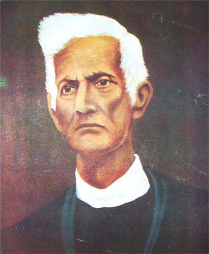

# ମୋ ଫକୀର ମୋହନ | Mo Fakir Mohan

> **ଡିଜିଟାଲ୍ ଐତିହ୍ୟ ପୋର୍ଟାଲ | Digital Heritage Portal**

A Django-based digital heritage portal dedicated to **Fakir Mohan Senapati** (1843-1920) - the revered Odia poet, novelist, and philosopher, often referred to as the *Vyasa Kabi* (the poet Vyasa) of Odisha.



---

## 🌟 Features

- **Bilingual Content** - Odia (ଓଡ଼ିଆ) & English support
- **Digital Library** - 9 PDF books by Fakir Mohan Senapati
- **User Authentication** - Registration, login, protected downloads
- **Article Management** - Categorized articles about life, works, and legacy
- **Photo Gallery** - Historical images and related content
- **Timeline** - Chronological events from Fakir Mohan's life
- **Django Admin** - Full content management interface

---

## 📚 Available Books

| Odia Title | English Title |
|------------|---------------|
| ଛ ମାଣ ଆଠ ଗୁଣ୍ଠ | Chha Mana Atha Guntha |
| ରେବତୀ | Rebati |
| ମାମୁଁ | Mamu |
| ପେଟେଣ୍ଟ ମେଡିସିନ୍ | Patent Medicine |
| ଗରୁଡ଼ ମନ୍ତ୍ର | Garudi Mantra |
| ବୀର ବୈଶାଳ | Birei Bisala |
| ଦକମୁନିସ | Dakamunis |
| ଆନନ୍ତ | RP Ananta |

---

## 🚀 Quick Start

### Prerequisites

- Python 3.10+
- Git
- Git LFS (for PDF files)

### Installation

```bash
# Clone the repository
git clone https://github.com/Tusarkanta-07/mo-fakir-mohan.git
cd "mo fakir mohan"

# Install Git LFS (if not already installed)
git lfs install

# Pull LFS files
git lfs pull

# Create virtual environment
python -m venv venv

# Activate virtual environment
# Windows:
venv\Scripts\activate
# Linux/Mac:
source venv/bin/activate

# Install dependencies
pip install django pillow

# Run migrations
python manage.py migrate

# Create superuser (admin)
python manage.py createsuperuser

# Run development server
python manage.py runserver
```

### Access the Application

- **Website**: http://localhost:8000
- **Admin Panel**: http://localhost:8000/admin

---

## 📁 Project Structure

```
mo_fakir_mohan/
├── mo_fakir_mohan/      # Django project settings
├── portal/              # Main application
│   ├── models.py        # Database models
│   ├── views.py         # View functions
│   ├── urls.py          # URL routing
│   ├── admin.py         # Admin configuration
│   └── templates/       # HTML templates
├── books/               # PDF books (Git LFS)
├── media/               # User uploads
├── static/              # Static files
├── manage.py            # Django CLI
└── README.md            # This file
```

---

## 🗄️ Database Models

- **Category** - Content organization
- **Article** - Articles with bilingual support
- **Document** - Downloadable PDFs (login required)
- **Book** - Books by Fakir Mohan (login required)
- **GalleryImage** - Photo gallery
- **TimelineEvent** - Life events chronology
- **UserProfile** - Extended user data

---

## 🔐 User Features

| Feature | Anonymous Users | Logged-in Users |
|---------|-----------------|-----------------|
| Browse articles | ✅ | ✅ |
| View timeline | ✅ | ✅ |
| View gallery | ✅ | ✅ |
| Download books | ❌ | ✅ |
| Download documents | ❌ | ✅ |
| Register | ✅ | - |
| Login/Logout | ✅ | ✅ |

---

## 🛠️ Tech Stack

| Component | Technology |
|-----------|------------|
| Framework | Django 6.0.1 |
| Language | Python, Odia, English |
| Database | SQLite3 |
| Frontend | HTML5, CSS3, JavaScript |
| Fonts | Google Fonts (Noto Sans Oriya) |
| File Storage | Git LFS |

---

## 📝 Admin Usage

1. Login to admin: `http://localhost:8000/admin`
2. Add categories, articles, books, documents
3. Manage users and gallery images
4. Track download statistics

---

## 🌐 Routes

| URL | Description |
|-----|-------------|
| `/` | Homepage |
| `/about/` | Biography & timeline |
| `/works/` | Literary works |
| `/books/` | Books list (download requires login) |
| `/documents/` | Document library (download requires login) |
| `/legacy/` | Legacy & influence |
| `/gallery/` | Photo gallery |
| `/article/<slug>/` | Article detail |
| `/login/` | User login |
| `/register/` | User registration |
| `/admin/` | Admin dashboard |

---

## 📄 Documentation

- [PROJECT_SUMMARY.md](PROJECT_SUMMARY.md) - Detailed project documentation

---

## 🔗 Repository

- **GitHub**: https://github.com/Tusarkanta-07/mo-fakir-mohan
- **Branch**: `main`
- **License**: MIT

---

## 🙏 Acknowledgments

This project is dedicated to preserving and promoting **Odia literature and culture** through digital means. All books and documents are works of **Fakir Mohan Senapati**, a pioneer of modern Odia literature.

---

## 📧 Contact

For questions or contributions, please open an issue on GitHub.

---

<p align="center">
<b>ଓଡ଼ିଆ ସାହିତ୍ୟ ଓ ସଂସ୍କୃତିର ସୁରକ୍ଷା ଓ ପ୍ରଚାର ପାଇଁ ଉତ୍ସର୍ଗୀକୃତ</b><br>
<em>Dedicated to the preservation and promotion of Odia literature and culture</em>
</p>
